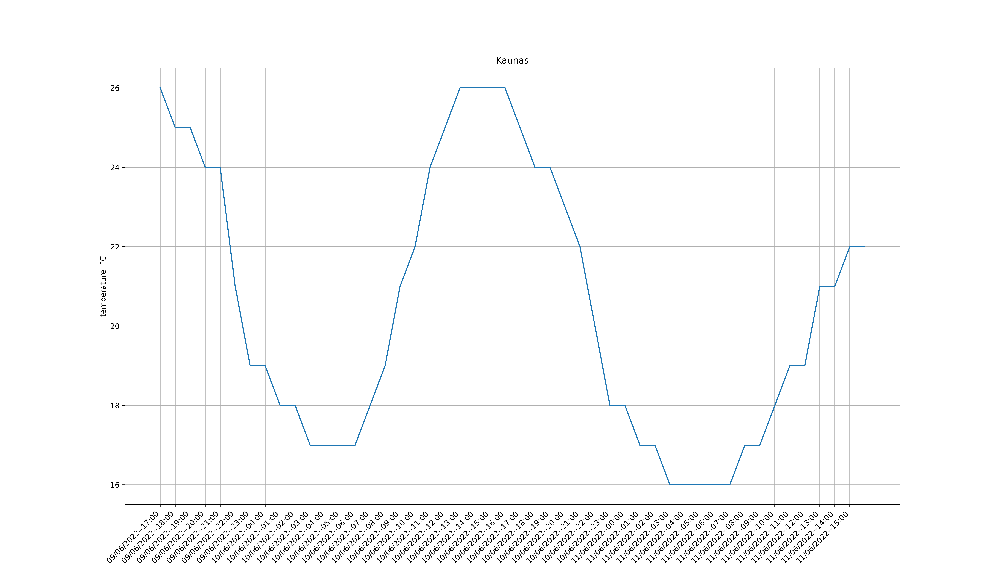
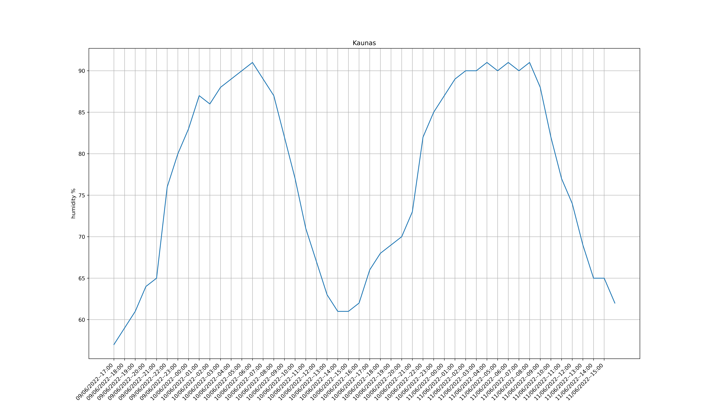
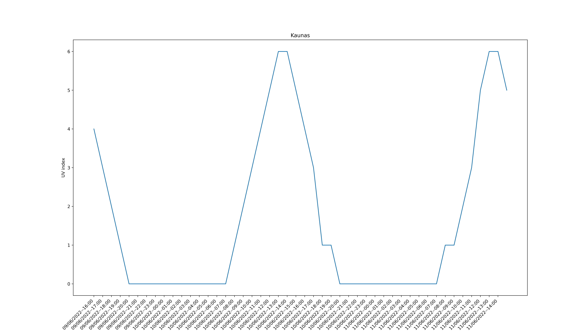
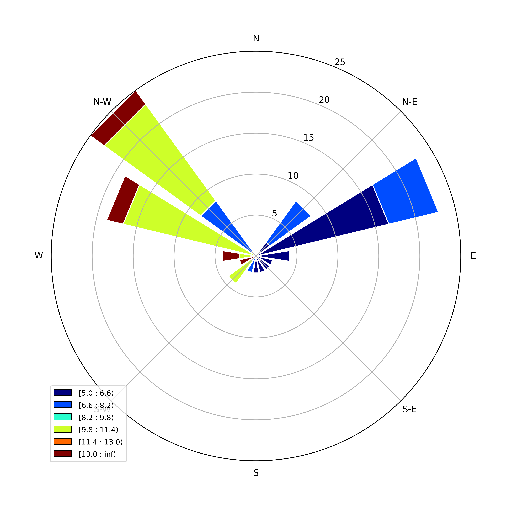

# meteoAPI
Extract meteorological data from [meteo.gr](https://www.meteo.gr/) and [weather.com](https://weather.com/) . More websites will be supported in future releases.

Access the HTML of the webpage for a certain location and, extract useful information/data from it, using the third-party python library, Beautiful Soup, a library for pulling data out of HTML and XML files.

## Features
***meteoAPI*** consists of many features, such as getting temperature, humidity, wind speed and direction, and many more. 

The extracted data can be plotted and also saved in <.csv> files.

## Demo ([Kaunas, Kaunas, Lithuania](https://weather.com/weather/hourbyhour/l/c0ad3acc0ae559d552ded89fb4af50e09b2063ef1ffa2bb7305acf6083011ea4))
### Temperature vs. daytime

### Humidity vs. daytime

### UV index vs. daytime

### Wind rose diagram


## Creator
* Yannis Marios Papagiannakos

## Requirements
* BeautifulSoup4
```bash
  pip install beautifulsoup4
```

* matplotlib
```bash
  pip install matplotlib
```

* numpy
```bash
  pip install numpy
```

* windrose and openpyxl
```bash
pip install windrose openpyxl
```

OR use the file: requirements.txt
```bash
  pip install -r requirements.txt
```